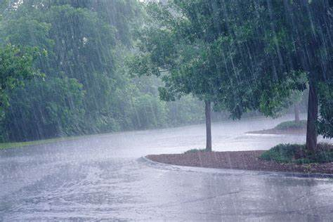

# RainFall-Prediction

Models used and their accuracies:-
1. Validation result for Logistic Regression 
   1. LogisticRegression()
   2. accuracy score: 84.09%

2. Validation result for SGDClassifier 
   1. SGDClassifier()
   2. accuracy score: 83.89%

3. Validation result for Random Forest 
   1. RandomForestClassifier()
   2. accuracy score: 85.31%

4. Validation result for KNN 
   1. KNeighborsClassifier()
   2. accuracy score: 83.26%

5. Validation result for Decision 
   1. DecisionTreeClassifier()
   2. accuracy score: 78.14%

Reference

https://towardsdatascience.com/automate-the-machine-learning-model-implementation-with-sklearn-pipeline-2ef1389062c9